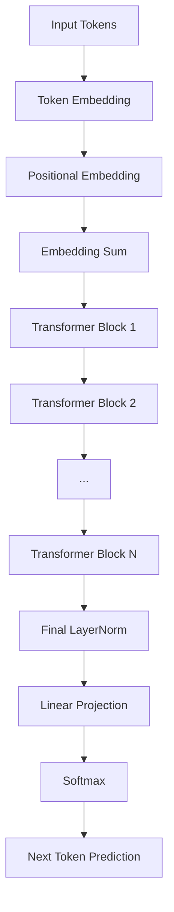
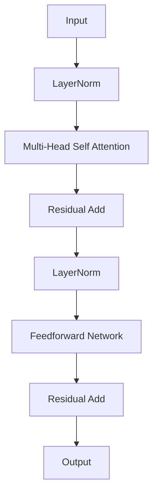
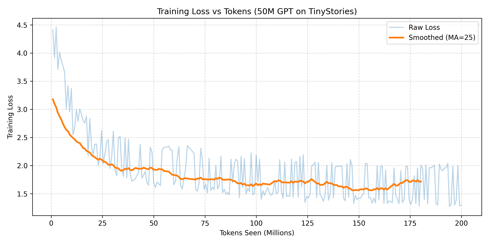
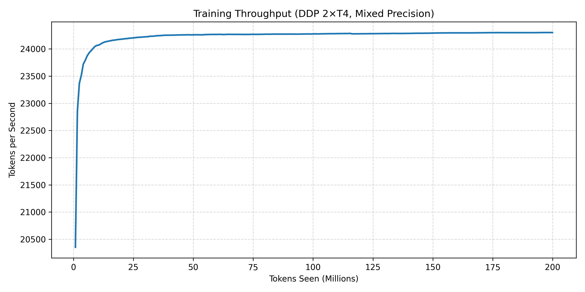

# StoriesGPT-50M  
A 50M parameter GPT-style language model trained from scratch on 200M tokens using Distributed Data Parallel (2× T4 GPUs).

---

## Overview

StoriesGPT-50M is a transformer-based autoregressive language model trained from scratch on the TinyStories dataset.  
The goal of this project was to:

- Implement a modern GPT architecture from first principles  
- Train efficiently using Distributed Data Parallel (DDP)  
- Optimize throughput with mixed precision (AMP)  
- Analyze convergence behavior over 200M tokens  

This project demonstrates end-to-end LLM engineering, not just fine-tuning.

---

## Model Weights

Due to GitHub file size limitations, trained weights are hosted on HuggingFace:
https://huggingface.co/yourusername/StoriesGPT-50M

---

## Model Architecture

- Parameters: ~50M  
- Context Length: 512  
- Vocabulary Size: 16,000 (ByteLevel BPE)  
- Architecture:
  - Multi-Head Self Attention
  - Pre-LayerNorm Transformer Blocks
  - GELU Feedforward
  - Residual Connections
- Optimizer: AdamW
- Precision: Mixed Precision (torch.cuda.amp)
- Parallelism: DDP across 2× NVIDIA T4 GPUs

---

## Architecture Overview


---

## Transformer Block Structure



## Training Setup

- Dataset: TinyStories  
- Tokens Trained: 200M  
- Hardware: 2× NVIDIA T4 (Kaggle GPU environment)  
- Throughput: ~24,000 tokens/sec  
- Training Strategy:
  - Streaming dataset (no full in-memory load)
  - Resume-from-checkpoint support
  - Automatic periodic checkpointing

---

## Training Performance

### Loss Curve



Training loss steadily decreased from ~5.0 to ~1.4 across 200M tokens, indicating stable convergence without divergence or instability.

---

### Throughput Stability



Training throughput remained stable at ~24k tokens/sec using DDP and mixed precision.

---

## Example Generations

**Prompt:**  
> Once upon a time  

**Output:**  
> Once upon a time, there was a little girl named Lily. She loved to play outside in the sunshine...

---

**Prompt:**  
> There was a rabbit named Max.  

**Output:**  
> There was a rabbit named Max. Max was a very friendly rabbit who loved to play with his friends...

---

The model demonstrates coherent narrative structure and grammatical consistency within the storytelling domain.

---

## Running Inference

```bash
pip install -r requirements.txt
python generate.py
```
---

## Project Structure
``bash
StoriesGPT_50M/
│
├── model.py
├── config.py
├── train.py
├── generate.py
├── tokenizer.json
├── model_final.pt
├── loss_curve.png
├── throughput_curve.png
└── README.md

---

## What This Project Demonstrates

- Training a transformer model from scratch
- Distributed training with torchrun
- Mixed precision optimization
- Checkpoint management
- Training curve analysis
- Clean modular ML project structure

---

## Future Improvements

- Scaling to 100M+ parameters
- Training on 1B+ tokens
- Adding Rotary Positional Embeddings (RoPE)
- Flash Attention integration
- Fine-tuning for conversational alignment

---

## Author
Devashish Mishra
B.Tech (AI/ML)